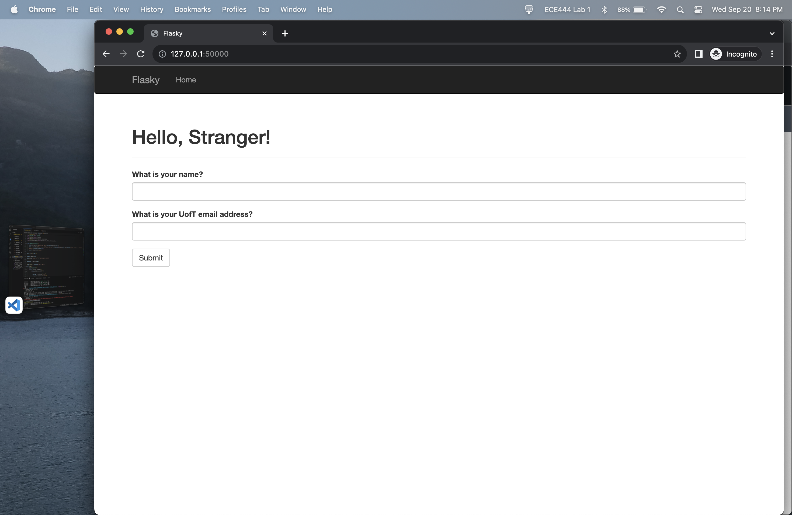
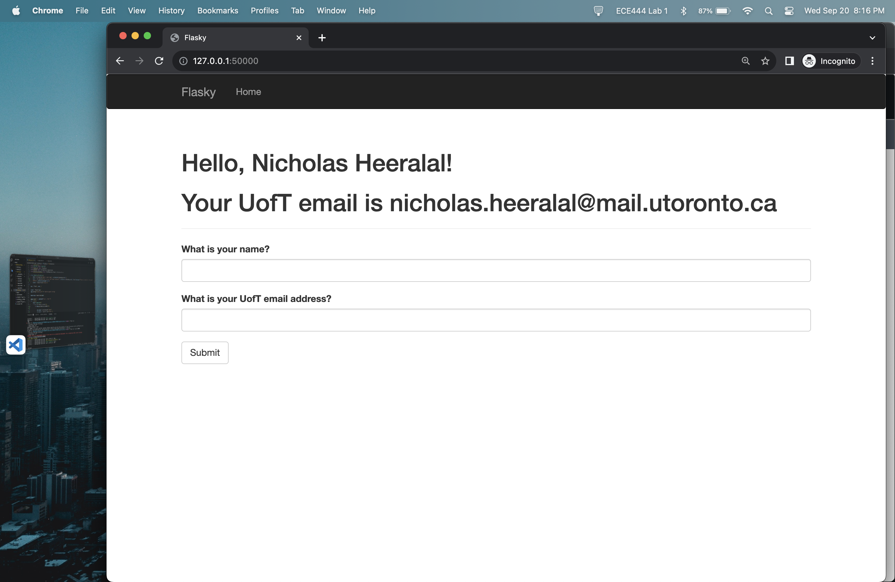
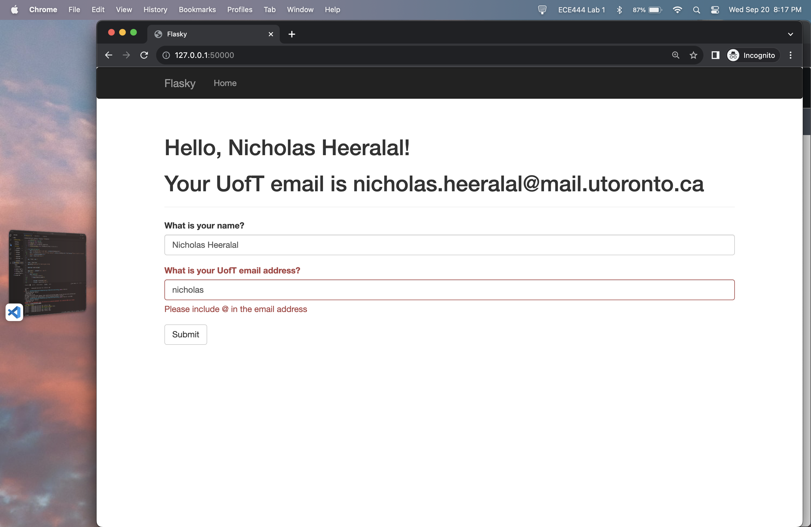

# Nicholas Heeralal Lab 1 ECE444

### Activity 1 
Screenshot showing that I have successfully finish the installation task

### Activity 2
Screenshot showing example 2-2 with my hello world html page with my name (Nicholas) on the web page.

### Activity 3
Screenshot showing my web page with 
1. a navigate bar on the top
2. “Hello [your name]!” as the title
3. a timestamp in ‘LLLL’ format.

### Activity 4
Activity 4 Step 2. Screenshot showing addition of one more field for filling in email address. 

Activity 4 Step 3. Screenshot showing filling in my first name and my UofT email address, then clicking submit.

Activity 4 Step 4. Screenshot showing filling in my first name and last name in the 1st field, and filling in my first name in the 2nd field, then clicking submit and received an error message  

Activity 4 Step 5. Screenshot showing filling in my first name and last name in the 1st field, and filling in my NON UofT email in the 2nd field, then clicking submit.  
